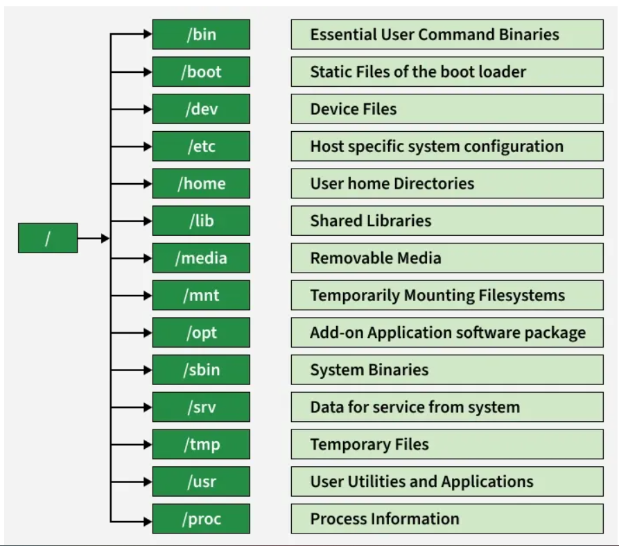

# 🐧 Linux File System & Core Commands

A comprehensive guide to understanding the Linux directory structure and the essential commands for navigation and file inspection.

---

## 📂 1. The Linux File System Structure
The Linux File System is a structured method of storing and organizing data on a Linux machine. It arranges files in a hierarchical directory format starting from the root directory /.

All files and directories in Linux originate from a single root directory /.
It follows a hierarchical tree structure, making navigation simple and logical.
Different directories like /home, /etc, /bin, and /var serve specific system purposes.
Linux supports multiple file system types like ext4, XFS, Btrfs, each offering different features.

In Linux, "Everything is a file." The system uses a hierarchical tree structure starting from the **Root** directory.

### 🌳 Directory Hierarchy
| Directory | Name | Description |
| :--- | :--- | :--- |
| `/` | **Root** | The absolute starting point of the file system. |
| `/bin` | **Binaries** | Essential executable programs (e.g., `ls`, `cp`, `bash`). |
| `/boot` | **Boot** | Static files of the boot loader (kernel, initrd). |
| `/dev` | **Devices** | Hardware components represented as files (e.g., `/dev/sda`). |
| `/etc` | **Etcetera** | **System-wide configuration files.** |
| `/home` | **Home** | Personal storage for users (e.g., `/home/username`). |
| `/root` | **Root Home** | The home directory for the root (admin) user. |
| `/tmp` | **Temporary** | Temporary files (usually cleared on reboot). |
| `/var` | **Variable** | Files that change size frequently, specifically **System Logs**. |

---


## 🧭 2. Navigation Commands
These commands are used to move around and identify your location within the hierarchy.

### `pwd` (Print Working Directory)
Shows the full path from the root to your current location.
* **Example:** `pwd` → Output: `/home/user/projects`

### `cd` (Change Directory)
Moves you from one directory to another.
* `cd /etc` : Move to the system configuration directory.
* `cd ..` : Move **up** one level in the tree.
* `cd ~` : Jump straight to your **Home** directory.
* `cd -` : Switch back to the **previous** directory you were in.

### `ls` (List)
Displays the files and folders inside a directory.
* `ls -l` : **Long Listing**. Shows permissions, owner, size, and timestamp.
* `ls -a` : **All**. Shows hidden files (files starting with a `.`).
* `ls -lh` : **Human Readable**. Displays file sizes in KB, MB, or GB.
* `ls -ltr` : Sorts by **Time** in **Reverse** (useful to see the newest files at the bottom).

---

## 📄 3. File Viewing Commands
Tools for reading the content of files without modifying them.

### `cat` (Concatenate)
Dumps the entire content of a file to the terminal screen.
* **Best for:** Small files.
* `cat -n filename.txt` : Displays the file with **line numbers**.

### `less`
Opens a file in an interactive viewer. It does not load the entire file into memory, making it very fast for huge files.
* **Best for:** Large text files or code.
* **Navigation:** Use `Arrow Keys` to scroll; press `q` to quit.

### `tail`
Outputs the last part of a file (default is the last 10 lines).
* **Best for:** Monitoring logs.
* `tail -n 20 filename.log` : Shows the last 20 lines.
* `tail -f filename.log` : **Follow mode**. Keeps the file open and prints new lines in real-time as they are written.

---

## 🚀 Pro Tip: Combining Commands
You can "pipe" commands together using the `|` symbol. For example, if you want to see if a specific user exists in the configuration file:

```bash
cat /etc/passwd | less